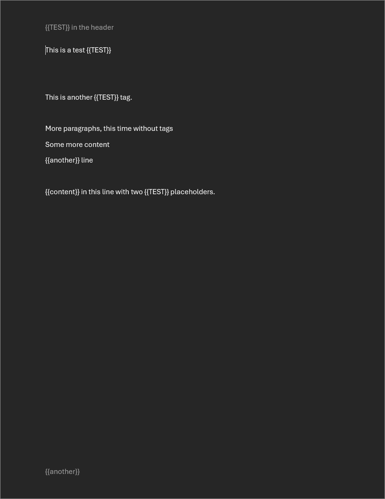
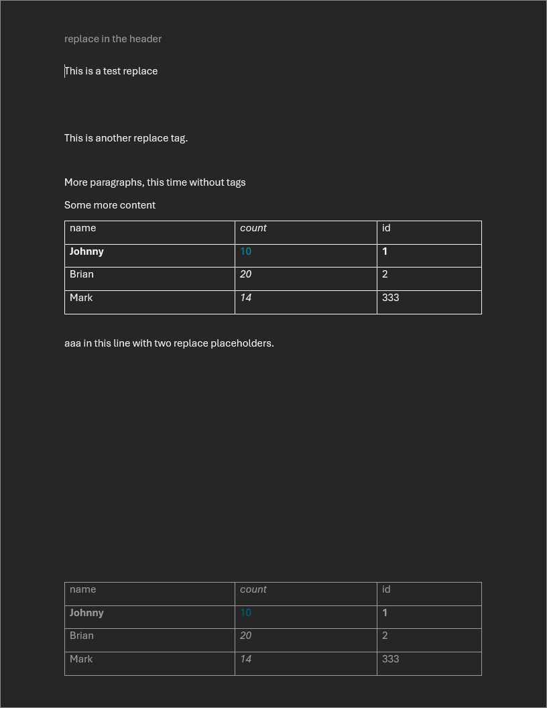

# ZTemplate

ZTemplate is a CLI tool for generating word documents from a template.
It replaces placeholders within the template with data from a specified data file.

Placeholders are denoted by the following syntax:
```

```

A placeholder can be replaced by either a single string or a table.
See the example in the [`test`](test/) folder for more information.

While not entirely novel, ZTemplate addresses a common challenge in document templating.
[go-docx](https://github.com/lukasjarosch/go-docx) is another project in this space, and its documentation highlights the complexities of text replacement,
particularly when text spans multiple "runs" within the DOCX structure.
See [this section](https://github.com/lukasjarosch/go-docx?tab=readme-ov-file#-how-it-works) of their README for more details.
While ZTemplate shares a similar approach to text replacement, a key distinguishing feature is its ability to insert tables.

---

## Running the project
The latest ZTemplate binary can be downloaded from the releases page.
If you are interested in building the project from source, follow the instructions in the section below.

To run ZTemplate, you can run the following command:
```bash
; ./ztemplate --template <path_to_template.docx> --output <output_file> --data <yaml_data_file>
```

## Building from source
### Requirements
- [Zig](https://ziglang.org/)

### To build
```bash
; zig build --release=safe
```

The output file will be in `zig-out/bin/ztemplate`

# Screenshots



## Next steps
- Improved Error Messages: The current error messages are not very user-friendly and need improvement.
- Advanced Styling: Currently, replaced text inherits the style of the placeholder. Future enhancements could allow overriding this style and expanding styling options for tables.
- Multi-Document Processing: Currently, ZTemplate processes documents one at a time. Future versions should support processing multiple documents concurrently.
